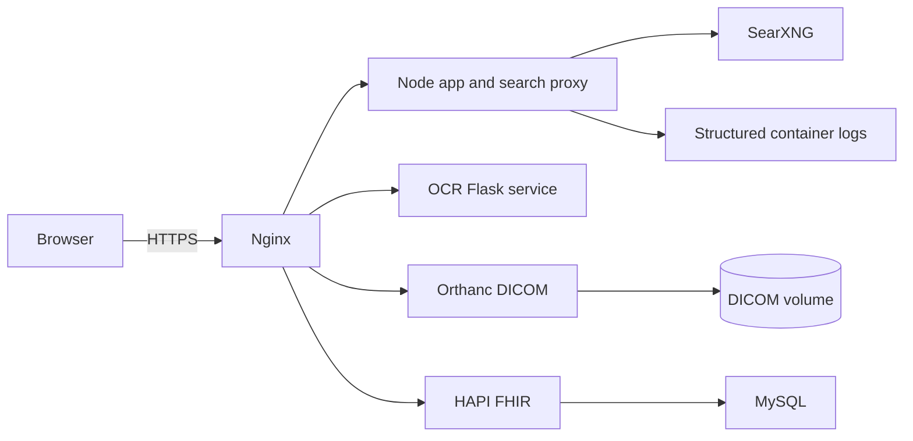

# Cura AI Health Architecture

The browser receives only same-origin APIs. Search queries pass through the
Node proxy, which sanitizes input, restricts sources, rate-limits requests, and
returns normalized results. Orthanc authentication is enforced by Orthanc in
the default stack and by Nginx Basic Auth in the production HTTPS overlay.

Clinical data volumes and database backups must be encrypted and stored with
access controls appropriate to the deployment environment.
